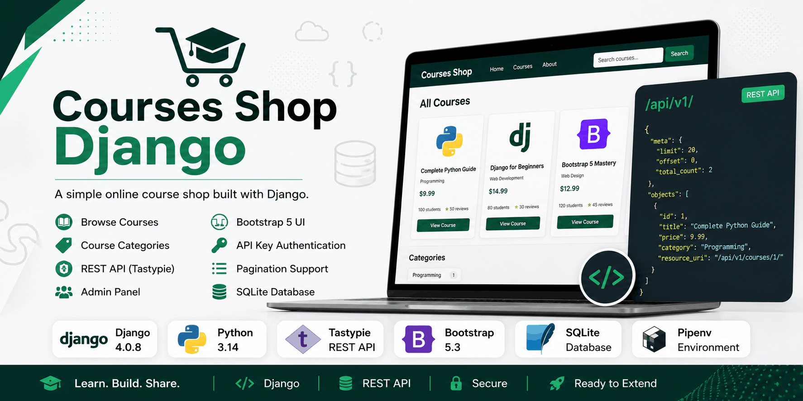

# Courses Shop Django


[](https://opensource.org/licenses/MIT)
[](https://www.djangoproject.com/)
[](https://www.python.org/)
[](https://django-tastypie.readthedocs.io/)
[](https://getbootstrap.com/)
[](https://www.sqlite.org/)
[](https://pipenv.pypa.io/)

A learning Django project for a simple online course shop. The app includes course and category models, a course listing page, a single course detail page, a REST API powered by Tastypie, Bootstrap 5 templates, and the Django admin panel.



## Tech Stack

- Python 3.14
- Django 4.0.8
- django-tastypie (REST API)
- SQLite
- HTML / CSS / Bootstrap 5
- Pipenv

## Features

- Home page with navigation
- Course listing page (`/shop/`)
- Single course detail page (`/shop/course/<id>`)
- REST API for categories and courses (`/api/v1/`)
  - GET, POST, DELETE for courses
  - GET for categories
  - API key authentication for write operations
  - Pagination support (`?limit=N&offset=N`)
- Category and Course models linked via ForeignKey
- Custom Django admin with inline courses and collapsible date fields
- Bootstrap 5 responsive templates with shared base layout

## Project Structure

```text
Courses-Shop-Django/
├── api/                       # REST API (Tastypie)
│   ├── migrations/
│   ├── models.py              # CategoryResource, CourseResource
│   ├── urls.py                # /api/v1/ routes
│   ├── authentication.py      # Custom API key auth
│   ├── admin.py
│   ├── apps.py
│   ├── tests.py
│   └── views.py
├── base/                      # Django project settings
│   ├── settings.py
│   ├── urls.py                # Root URL configuration
│   ├── wsgi.py
│   └── asgi.py
├── shop/                      # Courses app
│   ├── migrations/
│   ├── static/                # App CSS
│   ├── models.py              # Category and Course models
│   ├── urls.py                # /shop/ routes
│   ├── views.py               # Course list & single course views
│   └── admin.py               # Custom admin configuration
├── home/                      # Home page app
│   ├── migrations/
│   ├── urls.py                # /  route
│   └── views.py               # Index view
├── createsuperuser/           # Custom createsuperuser app (stub)
│   ├── migrations/
│   └── ...
├── templates/                 # Shared and app templates
│   ├── base.html              # Base layout with Bootstrap 5 navbar
│   ├── footer.html
│   ├── home/
│   │   └── index.html
│   └── shop/
│       ├── courses.html        # Course listing page
│       └── single_course.html  # Single course detail page
├── static/                    # Shared static files
│   └── shared/
├── manage.py
├── Pipfile
├── Pipfile.lock
├── start.md
└── start.txt
```

## Installation and Setup

### 1. Clone the repository

```bash
git clone https://github.com/<username>/Courses-Shop-Django.git
cd Courses-Shop-Django
```

### 2. Install dependencies

Using Pipenv:

```bash
python -m pip install pipenv
python -m pipenv install
python -m pipenv shell
```

Or using a regular virtual environment:

```bash
python3 -m venv .venv
source .venv/bin/activate
python -m pip install --upgrade pip
python -m pip install Django==4.0.8 django-tastypie
```

For Windows PowerShell:

```powershell
py -m venv .venv
.\.venv\Scripts\Activate.ps1
python -m pip install --upgrade pip
python -m pip install Django==4.0.8 django-tastypie
```

### 3. Apply migrations

```bash
python manage.py migrate
```

### 4. Create a superuser

```bash
python manage.py createsuperuser
```

### 5. Run the development server

```bash
python manage.py runserver
```

After starting the server, the project will be available at:

```text
http://127.0.0.1:8000/
```

Django admin:

```text
http://127.0.0.1:8000/admin/
```

REST API:

```text
http://127.0.0.1:8000/api/v1/
```

## Routes

| URL                     | Description                 | Methods     |
| ----------------------- | --------------------------- | ----------- |
| `/`                     | Home page                   | GET         |
| `/shop/`                | Course list                 | GET         |
| `/shop/course/<id>/`    | Single course detail        | GET         |
| `/admin/`               | Django admin panel          | —           |
| `/api/v1/courses/`      | API: list/create courses    | GET, POST   |
| `/api/v1/courses/<id>/` | API: retrieve/delete course | GET, DELETE |
| `/api/v1/categories/`   | API: list categories        | GET         |

## REST API

The project exposes a REST API via [django-tastypie](https://django-tastypie.readthedocs.io/).

### Authentication

- **GET** requests are allowed without authentication.
- **POST** and **DELETE** requests require an API key.

Add the following header to your requests:

```text
Authorization: ApiKey <username>:<api_key>
```

### Pagination

Use query parameters `limit` and `offset`:

```text
GET /api/v1/courses/?limit=10&offset=20
```

### Example Responses

#### GET /api/v1/courses/

```json
{
  "meta": {
    "limit": 20,
    "next": null,
    "offset": 0,
    "previous": null,
    "total_count": 2
  },
  "objects": [
    {
      "category": "Programming",
      "category_id": 1,
      "id": 1,
      "price": 9.99,
      "reviews_qty": "50",
      "students_qty": 100,
      "title": "COMPLETE PYTHON GUIDE",
      "resource_uri": "/api/v1/courses/1/"
    }
  ]
}
```

#### GET /api/v1/categories/

```json
{
  "meta": {
    "limit": 20,
    "next": null,
    "offset": 0,
    "previous": null,
    "total_count": 1
  },
  "objects": [
    {
      "created_at": "2024-01-01T00:00:00",
      "id": 1,
      "resource_uri": "/api/v1/categories/1/",
      "title": "Programming"
    }
  ]
}
```

### Creating a course (POST)

```json
POST /api/v1/courses/
Authorization: ApiKey bogdan:asdh1kl2513413561
Content-Type: application/json

{
  "title": "Django Advanced",
  "price": 19.99,
  "students_qty": 50,
  "reviews_qty": 10,
  "category_id": 1
}
```

### Deleting a course (DELETE)

```text
DELETE /api/v1/courses/1/
Authorization: ApiKey bogdan:asdh1kl2513413561
```

## Models

### Category

Represents a course category.

Fields:

- `title` — category name (CharField, max 255)
- `created_at` — creation date (DateTimeField, default: now)

### Course

Represents a course that belongs to a category.

Fields:

- `title` — course title (CharField, max 300)
- `price` — course price (FloatField)
- `students_qty` — number of students (IntegerField)
- `reviews_qty` — number of reviews (IntegerField)
- `category` — ForeignKey to Category (CASCADE)
- `created_at` — creation date (DateTimeField, default: now)

## Adding Sample Data in Django Shell

```bash
python manage.py shell
```

```python
from shop.models import Category, Course

category = Category.objects.create(title="Programming")

Course.objects.create(
    title="Complete Python Guide",
    price=9.99,
    students_qty=100,
    reviews_qty=50,
    category=category,
)

Course.objects.all()
```

## Common Commands

```bash
# Run the development server
python manage.py runserver

# Create migrations
python manage.py makemigrations

# Apply migrations
python manage.py migrate

# Create a superuser
python manage.py createsuperuser

# Open Django shell
python manage.py shell
```

## Note

This project was created for learning Django. The current settings are intended for local development: SQLite is used as the database, `DEBUG=True` is enabled, and the secret key is stored in `settings.py`. Before using this project in production, move sensitive values to environment variables and configure production security settings.
